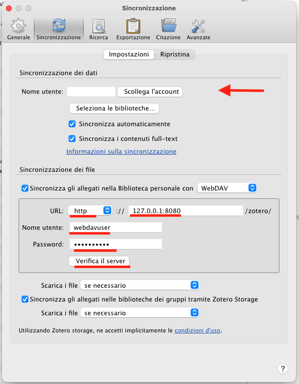

# Synchronize Zotero for Free on Multiple Devices

Still uncomplete...

This guide presents a way to freely synchronize and backup your Zotero library on multiple devices.

Requirements:
- Zotero https://www.zotero.org/
- Docker https://www.docker.com/
- kdrive https://www.infomaniak.com/it/kdrive

...

Based on the following docker image https://hub.docker.com/r/derkades/webdav

1. Clone the repository;

`git clone https://github.com/giovannifarina/webdav_zotero.git`

2. Edit the `volume` parameter in `docker-compose.yml` and specify the path to folder containing the Zotero's data, e.g.

`volumes: ['/Users/gio/kDrive/webdav_zotero:/data']`

You can edit the other basic configuration parameters therein if you like;

3. Execute the following code

`docker-compose build`

`docker-compose -p webdav_zotero up -d`

4. Edit Zotero's settings
   1. Login with your Zotero account
   2. Below, select WebDAV
   3. Set the parameters as in the following picture
   4. Click on the verify button to check if WebDAV is properly working

    

